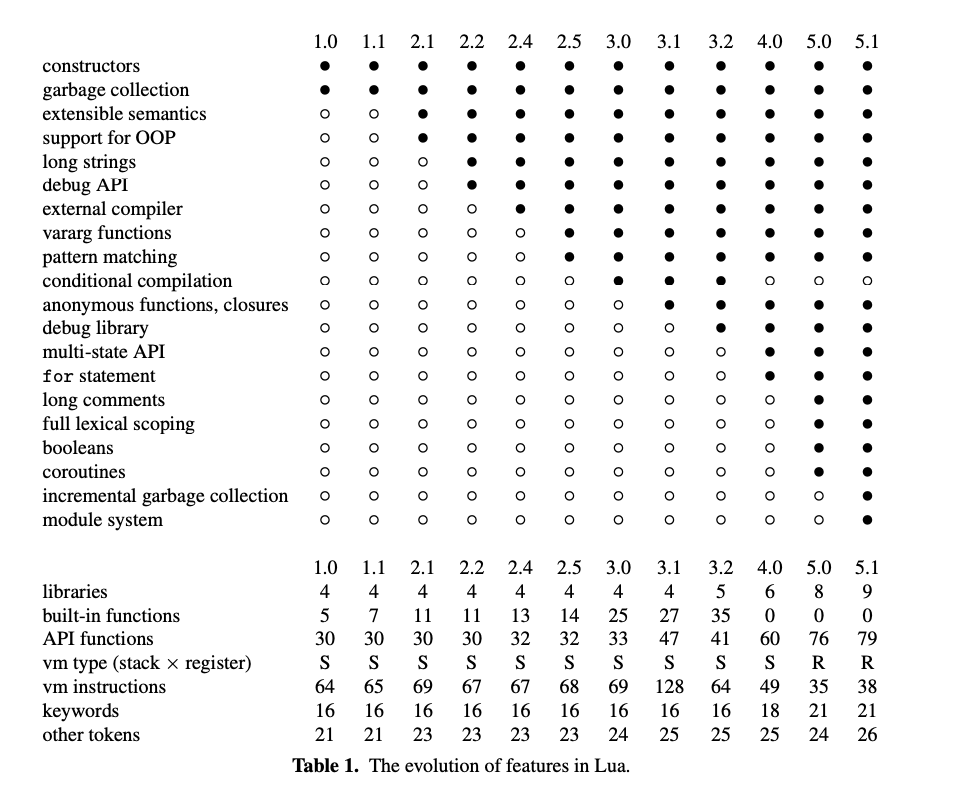

# Survey

## Lua Design & Evolution

1. *The design and implementation of a language for extending applications*
by L. H. de Figueiredo, R. Ierusalimschy, W. Celes,
Proceedings of XXI Brazilian Seminar on Software and Hardware (1994) 273–283.
[reprint](http://www.lua.org/semish94.html)

- Designed as an embedded language to facilitate customizable applications.
- Lua overview including tables (associative arrays) and values being typed (not variables) and interaction with host language.
- Architecture based on Smalltalk (i.e. designing VM, compiling into bytecodes for VM, simulating VM by interpreting bytecodes as opposed to interpreting source).  
- Lexical / syntatical analysis done once, provide a means for error checking, extension programs can be provided in precompiled bytecode.
- VM overview (stack machine, registers, support for varargs, calling functions written in host using CALLFUNC).
- Internals (values implemented as struct with type and union containing value, tables are hash tables with separate chaining, garbage collection with mark-and-sweep).  

2. *Lua: an extensible embedded language*
by L. H. de Figueiredo, R. Ierusalimschy, W. Celes,
Dr. Dobb's Journal 21 \#12 (Dec 1996) 26–33.
[reprint](http://www.lua.org/ddj.html)

- Design goals (extension languages: clear and simple syntax, small size ~6k lines of ANSI C for Lua, good data description, extensibility; first-class functions, single data constructor = tables).
- Functions in Lua = body precompiled and stored as the value of the function assigned to global var with function name.
- Tables (associative arrays) are objects, not values, variables contain references to tables (i.e. can represent recursive data types, generic graphs).
- Reflexivity in Lua enables dynamic typing and allows a program in Lua to manipulate it's own environment.
Tk (GUI toolkit) and Lua by mapping widgets example.

3. *A Look at the Design of Lua*
by Roberto Ierusalimschy, Luiz Henrique De Figueiredo, Waldemar Celes
Communications of the ACM, November 2018, Vol. 61 No. 11, Pages 114-123
10.1145/3186277
[CACM](https://cacm.acm.org/magazines/2018/11/232214-a-look-at-the-design-of-lua/fulltext)

- Lua is multi-paradigm (supports object oriented, functional, data-driven programming).
- Objective is to support "mechanisms instead of policies."
Design goals (simplicity, small size, portability ~300k bytes memory, embeddability).
- Lua-C API allows for manipulation of Lua values and interoperability.
- Overview of tables including how underlying implementation provides sparse arrays and how tables implement weak references.
- Functions discussed in conjunction with chunks (code fed to `load`, compilation unit) and enclosing anonymous functions.
- Modules supported through the use of first class functions and tables. Note that the simplicity supports integration with the host language. It's possible to create modules in Lua or C or mixed modules with functions defined in either language.
- Environments create flexibility in terms of combining multiple modules in a program without using global variables since the enclosing anonymous function of a compiled chunk is given the scope of a local var `_ENV` and any free var `id` is translated to `_ENV.id` so all chunks share the same environment by default.
-  For object oriented programming, objects and classes are tables so "instance of" is a dynamic relationship. Classes (metatables) in this paradigm define methods for standard operators (metamethods). Prototypes are supported based on delegation via the `__index` metamethod for retrieving values of absent keys. A `self` parameter allows the method to access the original parameter.
- Exception handling packed into the C API with `lua_pcall` and allows errors to be raised with `lua_error` which are reflected into Lua.
- Coroutines in lua are first class values that can suspend execution, offer two control transfer operations `resume` and `yield` and they are equivalent to one-shot continuations. They support cooperative multithreading and control flow modification.
- Overall while mechanisms may not be as straightforward or streamlined as a result of Lua's simplicity, their semantics are clear and they support interoperability through the C API.
- Lua's use of mechanisms and modularity to support mechanisms enables it's small size since abstractions can be achieved by leveraging the already existing mechanisms.
- The authors note that this flexibility might be too permissive leading to multiple systems.

4. *The Evolution of Lua*
by R. Ierusalimschy, L. H. de Figueiredo, W. Celes
Proceedings of ACM HOPL III (2007) 2-1–2-26
[slides](http://www.inf.puc-rio.br/~roberto/talks/hopl-slides.pdf)
[paper](https://www.lua.org/doc/hopl.pdf)

- Extensible extension language (extensible semantics) echoes "mechanisms not policies" and extensible because userdata type can bring in data from the application Lua is emedded in
- The Lua can interface with C, C++, and other languages (including Java, Ada, C#, Ruby and more)
- Lua 5.1 source has 17k LOC (the Lua interpreter built with all Lua standard libraries takes 143K on Linux)
- 1993 Tecgraf (CG Group of the pontifical Catholic University of Rio de Janeiro), market reserve for hardware / software, Tecgraf developed data-entry and configurable report generators for Petrobas (Del and Sol were the precursors to Lua). It's why data description was a motivation for the design of Lua
- booleans and threads introduced as types in Lua 5.0

- VM stack based until Lua 4.0, register based since 5.0 to minimize time in instruction dispatch based on result in [this paper](https://dl.acm.org/doi/10.1145/858570.858575) that register format reduces the number of executed instructions (according to authors first widespread use of register-based virtual machine)

5. *Passing a Language Through the Eye of a Needle*
Roberto Ierusalimschy, Luiz Henrique de Figueiredo, and Waldemar Celes. 2011. Passing a Language through the Eye of a Needle. Queue 9, 5 (May 2011), 20–29. DOI:https://doi.org/10.1145/1978862.1983083
[ACM DL](https://dl.acm.org/doi/10.1145/1978862.1983083)

- Integration with system language = extending scripting language with and embedding scripting language in host
- Foreign Function Interfaces (FFI) is sufficient for extending and more challenging for embedding
- The article describes how embeddability shaped lua
- C is commonly the host languages, APIs for most scripting language include functions / types / constants and this API dictates what is accessible within the scripting language
- Scripts run by host calling `eval` function to execute but can be inefficient (parsing & interpreting chunks at interaction) and cumbersome (string manipulation)
- Other considerations include calling functions within scripts, error-handling, data transfer
- Reflection via writing library in host to export API back to scripting language (e.g. Lua function `type` returns type of a value implemented in C)
- Other forms of exposed control include iterators, error handling (based on `longjump` in C), coroutines
- 2 modes for calling Lua function: protected (`lua_pcall`) handles error through recovery point with `setjmp`, unprotected does not and longjumps to protected call
- Coroutines are symmetric (goto like transfer) or asymmetric (`resume` transfers control and `yield` stops and and returns to the other coroutine) but C doesn't support manipulating call stack to make a transfer for symmetric coroutines (because of this limitation a C function cannot occur between a `resume` and `yield`)
- Necessary to support efficient data transfer
- Extending Lua with host functions through `lua_pushcfunction` takes pointer to C function that pushes Lua function on stack which in turn calls C function
- Tables only data-structure, created and returned via env variables available to a process via `os_environ` and the process applies to any entity represented by a table (e.g. modules, objects)
- Lua has a `load` function instead of an `eval` function that creates a Lua function to execute a given piece of code (maps text to value instead of an action, no execution or side effects). All Lua code contained within a function
- A Lua table specifies an environment (global vars / unbound names are fields in table tied to the enclosing function)
- On account of lexical scoping, host code cannot access local vars (this also means all local vars can be placed in registers in the register-based VM)
- The API shaped the design of the language and vice versa

## LuaJIT

LuaJIT is a tracing just-in-time compiler that combines an interpreter and the tracing JIT compiler. LuaJIT also exposes an foreign function interface (ffi) to directly call C functions. Note: the wiki has good documentation of the internals including the [bytecode](http://wiki.luajit.org/Bytecode-2.0), [intermediate representation](http://wiki.luajit.org/SSA-IR-2.0) (e.g. IR uses aux snapshots), and [optimizations](http://wiki.luajit.org/Optimizations). Also this guide [numerical computing performance guide](http://wiki.luajit.org/Numerical-Computing-Performance-Guide) provides information on how to write performant Lua when using LuaJIT and might be a good starting point for thinking about how to contribute to the runtime (e.g. unbiased / unpredictable branches are very costly).

[Project Page](http://luajit.org/luajit.html)

 *LuaJIT 2.0 intellectual property disclosure and research opportunities* (Note: includes overview of design decisions.)
by Mike Pall
[lua-users](http://lua-users.org/lists/lua-l/2009-11/msg00089.html)]

See [runtime_luajit.md](../weeks4&5/runtime_luajit.md) for notes.

## Terra

Terra is designed as a low level companion language to Lua and can be meta-programmed in Lua. The use cases are very interesting and one that stands out is the ability to "compile domain specific languages (DSLs) written in Lua into high-performance Terra code" ([terralang.org](http://terralang.org/)).

[Project Page](http://terralang.org/)

-

1. *Terra: A Multi-Stage Language for High-Performance Computing*
by Z. DeVito, J. Hegarty, A. Aiken, P. Hanrahan, J. Vitek
PDLI '13
[paper](http://terralang.org/pldi071-devito.pdf)

*Abstract*

> High-performance computing applications, such as auto-tuners and
domain-specific languages, rely on generative programming techniques to achieve high performance and portability. However, these
systems are often implemented in multiple disparate languages and
perform code generation in a separate process from program execution, making certain optimizations difficult to engineer. We leverage a popular scripting language, Lua, to stage the execution of
a novel low-level language, Terra. Users can implement optimizations in the high-level language, and use built-in constructs to generate and execute high-performance Terra code. To simplify metaprogramming, Lua and Terra share the same lexical environment,
but, to ensure performance, Terra code can execute independently
of Lua’s runtime. We evaluate our design by reimplementing existing multi-language systems entirely in Terra. Our Terra-based autotuner for BLAS routines performs within 20% of ATLAS, and our
DSL for stencil computations runs 2.3x faster than hand-written C.

- Motivation: "domain-specific languages (DSLs) can achieve the same goal for a range of similar applications through domain-specific optimizations"
- DSL / auto-tuner includes (1) optimizer for domain specific transforms, (2) compiler for performant code, (3) runtime. They should be able to access each other
- "all parts of the toolchain, compiler, generated code, and runtimes, should inter-operate amongst themselves" which requires working at a high and low level
- Paradigm of multi-stage programming (Lua & Terra). Terra statically-typed with manual memory management. Lua can be used to generate / execute Terra code
- Terra executes in separate runtime even though Lua and Terra share the same lexical environment and can run on a different thread. Terra also exposes hardware features
- Lua's stack based API promotes inter-operability
- Terra has type reflection (so it's simple but components e.g. class systems can be created)
- Terra functions lexically-scoped, statically-typed, annotations on parameters & return types
- Terra functions / types / vars / expressions are first class Lua values, values are Terra types (base types / arrays / pointers / structs). Structs may include methods as Terra functions stored in Lua table for each Terra type
- A Lua function can create a Terra type at runtime (like C++ templates)
- If a Terra function is called from Lua, it's JIT compiled or it can be linked to a C executable if saved as a .o file
- Brackets [] = the escape operator so a value in Lua can be spliced into Terra
- quote creates block of Terra that can be spliced into a different Terra expression
- Design goals: easy prototyping domain-specific transforms, dynamically compile transform results into performant code, support with runtime libraries
- LuaJIT's FFI used to translate values on function call boundaries & during specialization (Lua tables to structs, functions to Terra functions, types converted on entry / exit)
- Terra expressions written as extension of Lua by adding functions to load and preprocess Lua-Terra programs building an AST for each Terra function that's then specialized, constructor includes parsed args and Lua closure for lexical environment (built on LuaJIT, LLVM used to compile Terra since IR is JIT-compiled to machine code, Clang for backwards compatibility with C) 

2. *The Design of Terra: harnessing the best features of high-level and low-level languages*
by Z. DeVito, P. Hanrahan
SNAPL ‘15
[paper](https://cs.stanford.edu/~zdevito/snapl-devito.pdf)

*Abstract*

> Applications are often written using a combination of high-level and low-level languages since
it allows performance critical parts to be carefully optimized, while other parts can be written
more productively. This approach is used in web development, game programming, and in
build systems for applications themselves. However, most languages were not designed with
interoperability in mind, resulting in glue code and duplicated features that add complexity. We
propose a two-language system where both languages were designed to interoperate. Lua is
used for our high-level language since it was originally designed with interoperability in mind.
We create a new low-level language, Terra, that we designed to interoperate with Lua. It is
embedded in Lua, and meta-programmed from it, but has a low level of abstraction suited
for writing high-performance code. We discuss important design decisions — compartmentalized
runtimes, glue-free interoperation, and meta-programming

- As noted above, discussion of paradigm of building some aspects of a system in a low-level performant language and also having components built in a high-level language and the pervasiveness of using multiple languages.
- Lua chosen because of its design that support interoperability with C.
- Terra and Lua have compartmentalized runtimes. Terra can run on GPUs.
- Terra type and function declarations automate bindings since they are first-class Lua statements.
- Code and types can be generated dynamically through meta-programming Terra in Lua which supports "runtime generation of low-level code."
- Terra designed to be semantically similar to C (including arithmetic, manual memory management, low level data types, type annotations).
- Terra compiled dynamically during the execution of the Lua program.
- If a Terra function is called from Lua code, args converted from Lua to Terra and then the result is converted back to a Lua value.
- Nested type and function definitions provide functionality similar to C++ templates.
- Design decisions guided by minimizing complexity while enabling multi-language programming and simplicity since that is one of Lua's primary design goals.
- Each language has its own runtime (LuaJIT for Lua). Terra compiled to machine code. Optimized with LLVM. Memory managed in Terra with `malloc` and `free`.
- Systems that augment high-level languages can be harder to debug, might result in a missed annotation, and improve performance rather than providing "near optimal performance that is possible when programming at a low level."
- Terra is only 15k LOC (Lua is 20k)
- Both languages use the same lexical environment ("one way to think of this design is that the Terra compiler is part of the Lua runtime"). E.g. mechanisms like namespaces are supported by using Lua tables to store Terra functions.
- Meta-programming enables transformations like auto-tuned libraries or writing domain-specific languages in Lua that can be compiled to Terra
- Multi-stage programming with explicit operators also support dynamic types in Terra since functions are compiled during the execution of the encapsulating Lua program
- Overview of example projects leveraging Terra and Lua in conjunction with one another including building domain specific languages... easier to develop and integrate high level languages to generate low level code generically enables using higher level abstractions and have them be highly performant
